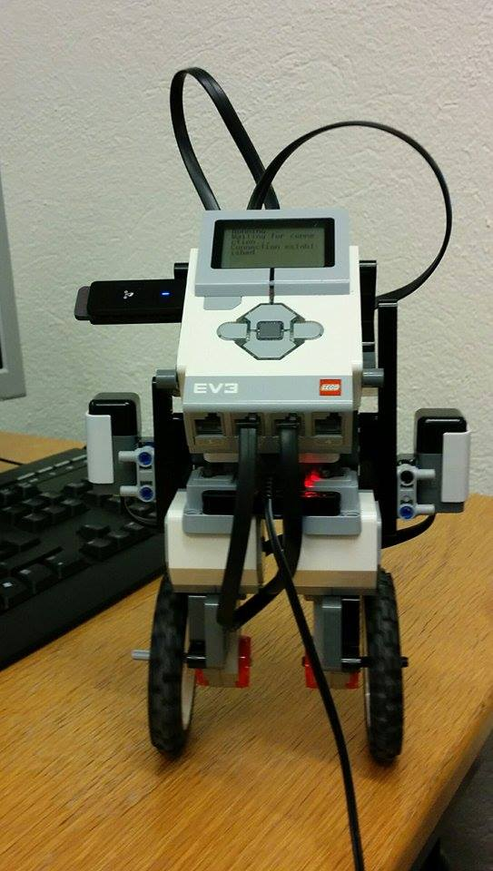
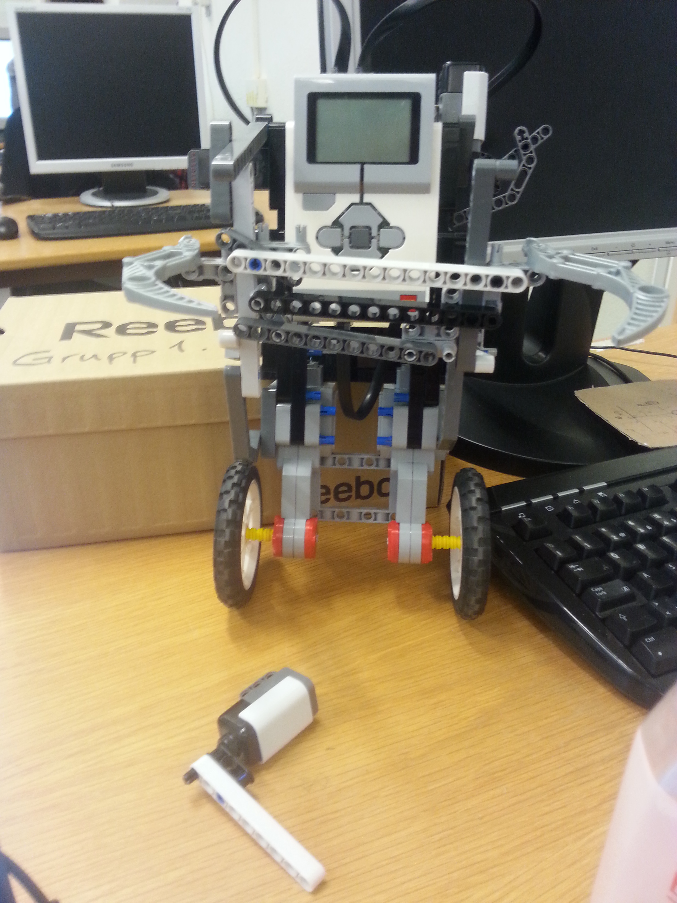
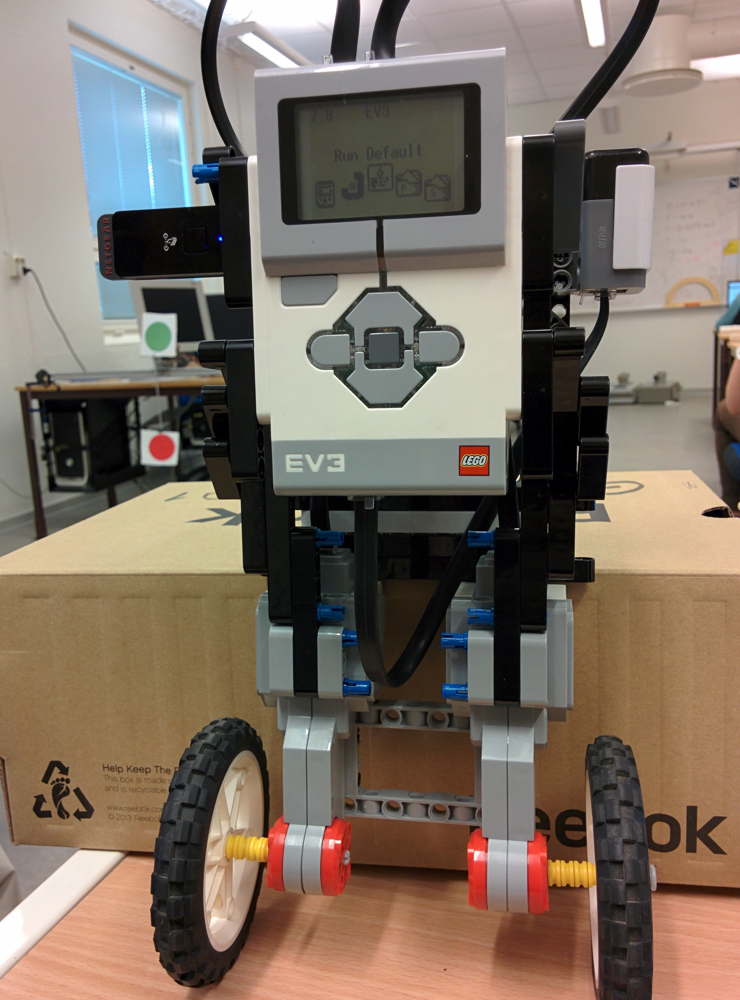

# LegoSegwayFRTN01
Control of Lego Segway, a project developed in the course "Real Time Systems" at Lund Institute of Technology.

#### 2015-05-11
Final design.

The actual working code is now on branch "test". Video to come, stay tuned.

#### 2015-04-24
Protection case developed by our design engineers. Safety first.

#### 2015-04-17
Our Lego Mindstorms Segway.

